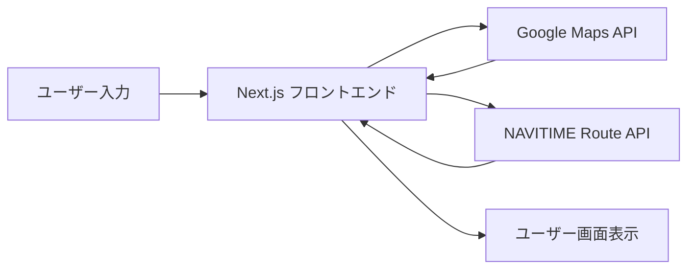

# ルート取得アプリケーション

## 使用技術スタック

- **フレームワーク**: Next.js
- **APIインテグレーション**:
    - Google Maps API
    - NAVITIME Route API (via RapidAPI)

## 主要機能

### 1. 座標取得機能

- **Google Maps APIの利用**
    - 出発地・目的地の座標（緯度・経度）の取得

### 2. 経路検索機能

- **NAVITIME Route APIとの連携**
    - 出発地・目的地の座標（緯度・経度）
    - 到着希望時刻を指定した経路検索
    - 複数の経路候補の取得（limit: 3）
    - 日本時間(JST)での時刻処理

## データフロー

## エラーハンドリング

- APIリクエストのエラー処理
- デバッグログの出力
- エラーレスポンスの詳細取得

## セキュリティ

- API Keyの環境変数での管理